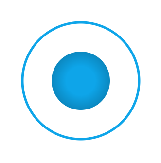

# Joystick JS



`Joystick JS` is a customizable virtual joystick class for web-based applications. It provides an intuitive interface for controlling movement or interacting with two-dimensional inputs using touch or mouse events.

## Demo

You can try out a live demo of the joystick to see how it works in real-time.
[Live Demo](joystick-js-demo.netlify.app)

## Features

-   **Customizable Design**: Easily customize the joystick's color, size, and border to match your application's theme.
-   **Responsive to Touch and Mouse**: Works seamlessly across both mobile (touch) and desktop (mouse) environments.
-   **Lightweight**: Optimized for performance with minimal overhead, making it suitable for both small projects and complex applications.
-   **Multiple Joysticks Support**: Create multiple independent joysticks on a single page with unique configurations for each.
-   **Real-Time Feedback**: Get real-time updates of joystick position, angle, and movement via a callback function.
-   **Auto-Centering**: Automatically reset the joystick to its center position when released, with the option to enable/disable this feature per axis.
-   **Axis Locking**: Control movement along a single axis (X or Y) or allow free movement in both directions.
-   **Inverted Axis**: Optionally invert the X or Y axis to fit your input scheme.
-   **Sensitivity Control**: Adjust the sensitivity to fine-tune how far the joystick moves in response to user input.

## Installation

Currently, the only available installation option is to download the `joystick-min.js` file directly and include it in your project.

```JavaScript
import { Joystick } from './path-to-your/joystick-min.js';
```

## Usage

### 1. Basic Implementation

For a quick and simple implementation, you can create a joystick with default settings. Just specify the container where the joystick will be rendered.

```JavaScript
import { Joystick } from './path-to-your/joystick-min.js'

const joystick = new Joystick('#joystick-container', {}, (position) => {
    console.log('Joystick Position:', position)
})
```

### 2. Advanced Implementation

For a fully customized implementation, you can provide configuration options to control every aspect of the joystick's behavior and appearance.

```JavaScript
import { Joystick } from './path-to-your/joystick-min.js'

const joystick = new Joystick(
    '#joystick-container',
    {
        id: 'myJoystick',
        color: '#3b82f6',
        size: 200,
        borderWidth: 10,
        autoCenter: { x: false, y: true },
        lockX: false,
        lockY: true,
        invertX: true,
        invertY: false,
        sensitivity: 2,
    },
    (position) => {
        console.log('Joystick Position:', position)
    }
)
```

## Options

The `Joystick` class provides several configuration options that allow you to fully customize the joystick's appearance and behavior. Below is a detailed breakdown of each available option:

| Option        | Type                | Default      | Description                                                                                                                                                                                                                                                                                                    |
| ------------- | ------------------- | ------------ | -------------------------------------------------------------------------------------------------------------------------------------------------------------------------------------------------------------------------------------------------------------------------------------------------------------- |
| `id`          | `string`            | `'joystick'` | The unique ID assigned to the joystick's canvas element. This can be used to differentiate between multiple joysticks on the same page.                                                                                                                                                                        |
| `color`       | `string`            | `#0ea5e9`    | Defines the color of the joystick's button and border. This option only accepts colors in hex format (e.g., `#ff0000` for red).                                                                                                                                                                                |
| `size`        | `number`            | `100`        | Sets the width and height of the joystick in pixels. The joystick will be rendered as a square based on this size.                                                                                                                                                                                             |
| `borderWidth` | `number`            | `5`          | Specifies the thickness of the joystick's border in pixels, making the border more or less prominent depending on the value.                                                                                                                                                                                   |
| `autoCenter`  | `boolean \| object` | `true`       | Determines whether the joystick should automatically return to its center position when released. Can be `true` (auto-center both axes), `false` (no auto-center), or an object `{ x: boolean, y: boolean }` for axis-specific control. For example, `{ x: false, y: true }` will only auto-center the Y-axis. |
| `lockX`       | `boolean`           | `false`      | If set to `true`, this locks the joystick's movement along the X-axis, allowing only vertical movement (Y-axis).                                                                                                                                                                                               |
| `lockY`       | `boolean`           | `false`      | If set to `true`, this locks the joystick's movement along the Y-axis, allowing only horizontal movement (X-axis).                                                                                                                                                                                             |
| `invertX`     | `boolean`           | `false`      | Inverts the direction of movement along the X-axis. When `true`, moving the joystick to the right will result in a leftward response, and vice versa.                                                                                                                                                          |
| `invertY`     | `boolean`           | `false`      | Inverts the direction of movement along the Y-axis. When `true`, moving the joystick upwards will result in a downward response, and vice versa.                                                                                                                                                               |
| `sensitivity` | `number`            | `1`          | Adjusts the joystick's sensitivity to movement. A higher value makes the joystick more responsive to small movements, while a lower value requires more movement for the same response.                                                                                                                        |

## API

The `Joystick` class provides getters to retrieve the current angle and position of the joystick, as well as a callback function that returns these values whenever the joystick is moved. Below are the available methods and their descriptions:

### 1. Getters

#### `joystick.angle`

This getter returns the current angle of the joystick in degrees, relative to its center. The angle is calculated based on the joystick's movement and its orientation on the screen.

```JavaScript
const joystick = new Joystick('#joystick-container', {}, () => {})
console.log('Joystick Angle:', joystick.angle) // Example output: 50.00
```

#### `joystick.x`

This getter returns the current X position of the joystick as a percentage of its total movement range. A value of 0% represents the center, while -100% and 100% represent the far left and right positions, respectively.

```JavaScript
const joystick = new Joystick('#joystick-container', {}, () => {})
console.log('Joystick X Position:', joystick.x) // Example output: 50.00
```

#### `joystick.y`

This getter returns the current Y position of the joystick as a percentage of its total movement range. A value of 0% represents the center, while -100% and 100% represent the top and bottom positions, respectively.

```JavaScript
const joystick = new Joystick('#joystick-container', {}, () => {})
console.log('Joystick Y Position:', joystick.y) // Example output: 50.00
```

### 2. Callback

The callback function, provided when creating a joystick instance, is triggered every time the joystick is moved. The callback receives an object containing the following properties:

-   `angle`: The angle of the joystick, in degrees (0-360).
-   `x`: The X position as a percentage (-100 to 100).
-   `y`: The Y position as a percentage (-100 to 100).

#### Example of Callback Usage

```JavaScript
const joystick = new Joystick('#joystick-container', {}, (position) => {
    console.log('Joystick Angle:', position.angle) // Example output: 50.00
    console.log('Joystick X Position:', position.x) // Example output: 50.00
    console.log('Joystick Y Position:', position.y) // Example output: 50.00
})
```

## Contributing

Contributions are welcome! Please open an issue or submit a pull request for any improvements or bug fixes.

## License

This project is licensed under the MIT License.
